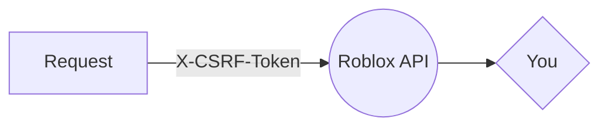
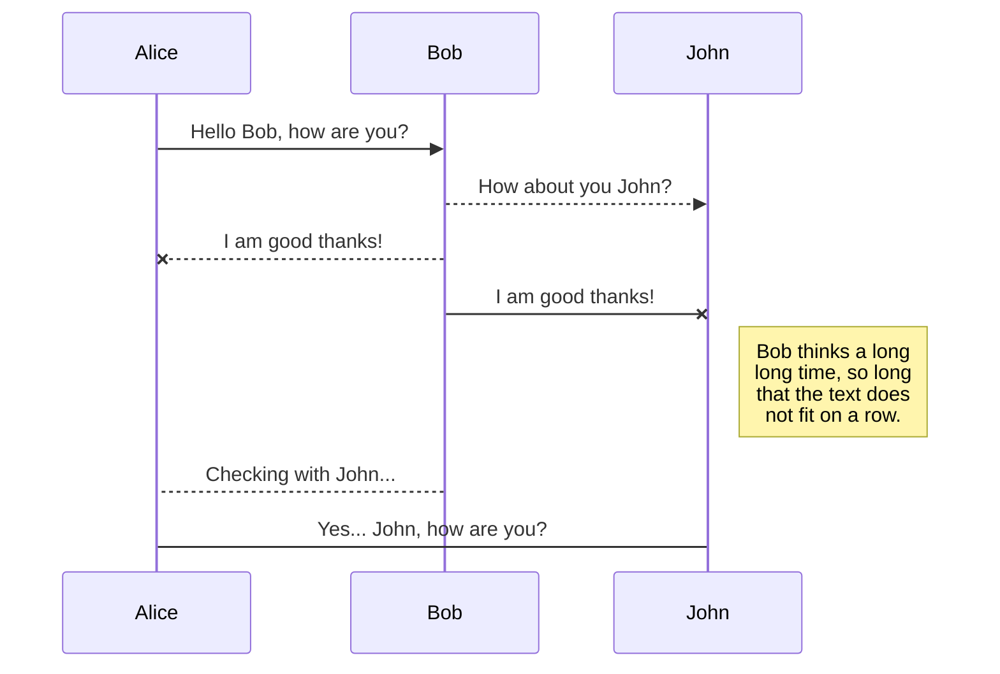
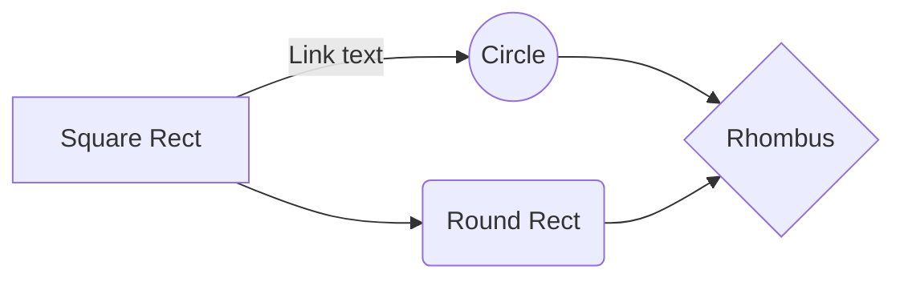

<p  align="center">


<h3  align="center">roblox.gg</h3>

<p  align="center">
Lightweight ROBLOX api wrapper
<br />
<p align="center">
<a  href="gg.ryeuin.ml"><strong>Explore the docs »</strong></a>

<a  href="https://yarnpkg.com/package/roblox.gg">View on Yarn</a> · <a  href="https://npmjs.org/package/roblox.gg">View on NPM</a> · <a  href="https://github.com/ryeuin/roblox.gg">Github</a></a>

</p>
</p>

</p>

## About



Roblox.gg is a lightweight NPM package with support for **common js**, **module js**, and **typescript**.

### Built With

</img>  </img>

<!-- GETTING STARTED -->

## Getting Started

This is an example of how you may give instructions on setting up your project locally.

To get a local copy up and running follow these simple example steps.

### Prerequisites

This is an example of how to list things you need to use the software and how to install them.

- npm

```sh

npm install npm@latest -g

```

### Installation

1. Get a free API Key at [https://example.com](https://example.com)

2. Clone the repo

```sh

git clone https://github.com/your_username_/Project-Name.git

```

3. Install NPM packages

```sh

npm install

```

4. Enter your API in `config.js`

```JS

const  API_KEY  =  'ENTER YOUR API';

```

<!-- USAGE EXAMPLES -->

## Usage

Use this space to show useful examples of how a project can be used. Additional screenshots, code examples and demos work well in this space. You may also link to more resources.

_For more examples, please refer to the [Documentation](https://example.com)_

<!-- ROADMAP -->

## 🚧 Roadmap

See the [open issues](https://github.com/roshanlam/ReadMeTemplate/issues) for a list of proposed features (and known issues).

<!-- CONTRIBUTING -->

## 🤝 Contributing

Contributions are what make the open source community such an amazing place to be learn, inspire, and create. Any contributions you make are **extremely appreciated**.

1. Fork the Project

2. Create your Feature Branch (`git checkout -b feature/AmazingFeature`)

3. Commit your Changes (`git commit -m 'Add some AmazingFeature'`)

4. Push to the Branch (`git push origin feature/AmazingFeature`)

5. Open a Pull Request

<!-- LICENSE -->

## 📝 License

Describe your License for your project.

Distributed under the MIT License. See `LICENSE` for more information.

<!-- CONTACT -->

## 📫 Contact

Your Name - [@your_twitter](https://twitter.com/your_username) - email@example.com

Project Link: [https://github.com/your_username/repo_name](https://github.com/your_username/repo_name)

<!-- ACKNOWLEDGEMENTS -->

## Acknowledgements

- [Img Shields](https://shields.io)

- [GitHub Pages](https://pages.github.com)

- [Font Awesome](https://fontawesome.com)

- blah blah blah....

<!-- MARKDOWN LINKS & IMAGES -->

<!-- https://www.markdownguide.org/basic-syntax/#reference-style-links -->

[forks-shield]: https://img.shields.io/github/forks/roshanlam/ReadMeTemplate?style=for-the-badge
[forks-url]: https://github.com/roshanlam/ReadMeTemplate/network/members
[stars-shield]: https://img.shields.io/github/stars/roshanlam/ReadMeTemplate?style=for-the-badge
[stars-url]: https://github.com/roshanlam/ReadMeTemplate/stargazers
[issues-shield]: https://img.shields.io/github/issues/roshanlam/ReadMeTemplate?style=for-the-badge
[issues-url]: https://github.com/roshanlam/ReadMeTemplate/issues
[linkedin-shield]: https://img.shields.io/badge/-LinkedIn-black.svg?style=flat-square&logo=linkedin&colorB=555
[linkedin-url]: https://linkedin.com/in/roshan-lamichhane

**strong text**

## UML diagrams

You can render UML diagrams using [Mermaid](https://mermaidjs.github.io/). For example, this will produce a sequence diagram:



And this will produce a flow chart:


