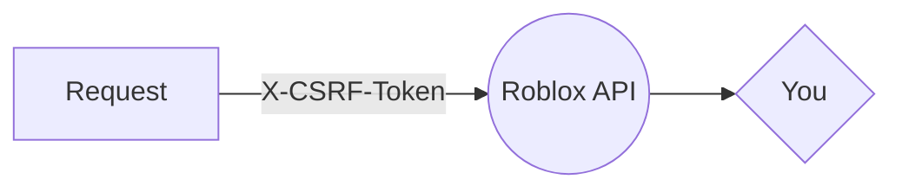

<p  align="center">


<h3  align="center">roblox.gg</h3>

<p  align="center">
Lightweight ROBLOX api wrapper
<br />
<p align="center">
<a  href="gg.ryeuin.ml"><strong>Explore the docs »</strong></a>
<p align="center"><a  href="https://yarnpkg.com/package/roblox.gg">View on Yarn</a> · <a  href="https://npmjs.org/package/roblox.gg">View on NPM</a> · <a  href="https://github.com/ryeuin/roblox.gg">Github</a></a></p>

</p>
</p>

</p>

## About



Roblox.gg is a lightweight NPM package with support for **common js**, **module js**, and **typescript**.

</img>  </img>

<!-- GETTING STARTED -->

## Getting Started

- npm:

```bash
npm i roblox.gg
```

- yarn

```bash
yarn add roblox.gg
```

## Usage

```javascript
const { GetAvatar } = require("roblox.gg");
GetAvatar({ username: "ryeuin" }).then((x) => console.log(x));
```
